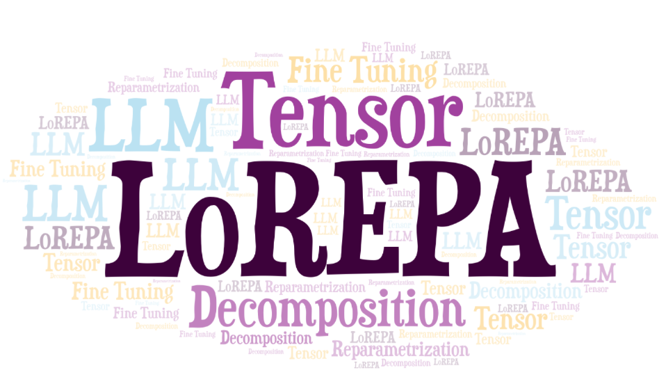

  

# Source Code for 'LoREPA: Low-Rank Economic Polyadic Adaptation'

> Project for the Ph.D Exam: Symbiotic AI: Low Rank solutions to improve the data quality and AI algorithms

> Authors: Alessandro Petruzzelli, Ivan Diliso, Eleonora Ghizzota

---

## Abstract 

Una delle più recenti innovazioni nel campo della linguistica computazionale è rappresentata dai modelli
di linguaggio di grandi dimensioni (Large Language Models, LLMs). Sebbene questi modelli siano in grado
di generare testo con caratteristiche simili a quello umano, spesso necessitano di una fase di allineamento
per adattarli a nuovi compiti mai affrontati prima, un processo noto come fine-tuning. A questo scopo,
sono state introdotte diverse tecniche per ridurre il numero di parametri da ottimizzare durante il fine-
tuning, con l’obiettivo di diminuire i requisiti computazionali senza compromettere significativamente le
prestazioni. In questo contesto si collocano metodi come LoRA (Low-Rank Adaptation) e LoRETTA, un
approccio basato sull’adattamento low-rank con decomposizione Tensor Train (TT). Per ridurre ulteriormente
il numero di parametri, introduciamo LoREPA (Low-Rank Economic Polyadic Adaptation), una tecnica di
fine-tuning efficiente per LLM che sfrutta la decomposizione tensoriale Polyadic Decomposition (CP). Questo
approccio consente di ridurre il numero di parametri “liberi” durante l’addestramento, ottimizzando le risorse
computazionali. Il nostro lavoro si è concentrato sull’implementazione della decomposizione CP, allineando i
nostri esperimenti alla stessa suite di valutazione utilizzata per LoRETTA, al fine di effettuare un confronto
diretto tra le due tecniche di low-rank adaptation. I risultati sperimentali dimostrano l’efficacia di LoREPA nel
task di classificazione, evidenziando un notevole risparmio di parametri rispetto ad altre tecniche come LoRA
e LoRETTA, a fronte di una lieve riduzione dell’accuratezza del modello.
